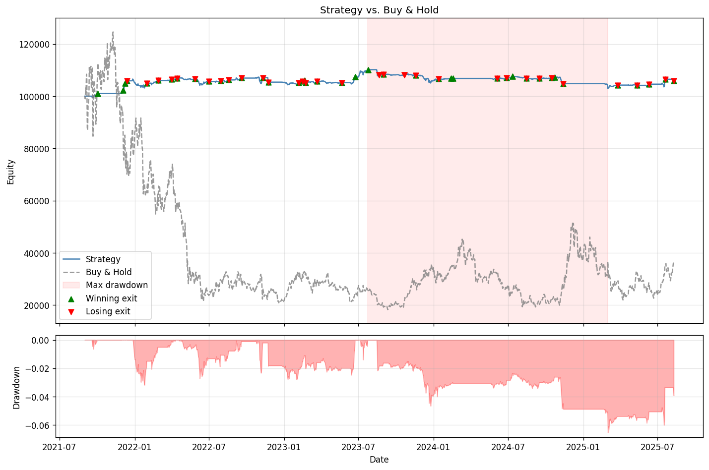
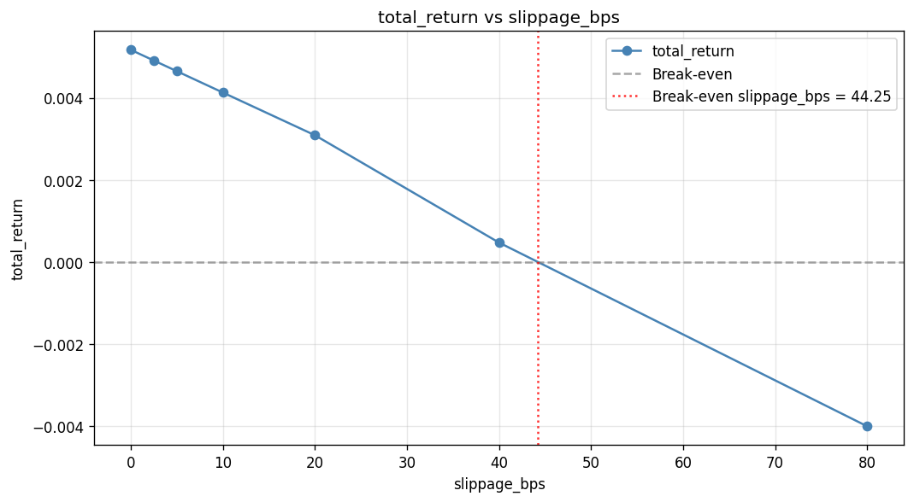

# Crypto Trader

An event-driven backtesting engine for cryptocurrency strategies, with walk-forward validation and cointegration-based pairs trading.

## Features

- Event-driven engine with next-bar fills
- Walk-forward validation with fold-local fitting: hedge ratios, pair selection, and trading-rule parameters are all fit on each fold's train window only
- Cointegration screening (Johansen trace test with a Phillips-Perron unit-root pre-filter) to find tradeable pairs
- Pairs mean-reversion strategy trading a hedged cointegration spread
- Fixed-fractional position sizing, slippage, and fee modeling
- Transaction-cost sensitivity sweep that finds the break-even slippage or fee level for a strategy
- Pluggable strategies, objectives, and relationship methods, selected by name from registries
- Equity-vs-benchmark, drawdown, and trade-marker visualization
- Config-driven CLI: one command runs a backtest or a full walk-forward and prints summary stats

## Architecture

Data flows from ingestion to a decision loop to performance metrics:

```
ccxt OHLCV  =>  prepare + merge + features  =>  Backtester loop  =>  Metrics / plots
                                                      |
                                      Strategy.gen_signal => gen_order
                                                      |
                                   Executor => Simulator (slippage, fills)
                                                      |
                                   Portfolio (positions, P&L, equity curve)
```

The `Backtester` drives the loop bar by bar. The `Strategy` produces a signal from current state, the `Executor` and `Simulator` turn it into a filled order on the next bar, and the `Portfolio` tracks positions, realized and unrealized P&L, fees, and the equity curve that `Metrics` scores.

Directory Structure:

| Directory | Role |
|---|---|
| `data_ingestion/` | Async ccxt OHLCV fetching, CSV caching, merge and feature prep |
| `feature_engineering/` | Rolling single-asset and multi-asset (spread) features |
| `strategies/` | Strategy base class, registry, and mean-reversion strategies |
| `backtest/` | Event-driven engine, executor, simulator, portfolio, walk-forward |
| `asset_analysis/` | Cointegration / correlation screening and hedge-ratio estimation |
| `metrics/` | Performance metrics and plotting |
| `configs/` | One config per strategy-mode combination |
| `tests/` | Unit tests for engine, portfolio, relationships, config |

## Methodology

**Lookahead Bias:** A signal computed from bar `i` fills on bar `i+1` open via a pending-orders queue, never on the close that produced it.

**Fold-local Fitting:** In walk-forward, the hedge ratio is re-estimated on each fold's train window, so beta never sees the data it is evaluated on. The grid search over trading-rule parameters is scored on train only.

**Selection Bias:** Choosing which pair to trade by full-sample cointegration leaks the test window into the choice, even if beta is refit online. The walk-forward selector screens each fold's train window and trades the top cointegrated pair, or sits the fold out if none cointegrate. The resulting out-of-sample figure is lower than a hand-picked pair would suggest.

## Quickstart

```bash
pip install -r requirements.txt

# single backtest, with chart
python -m backtest mr_pairs_backtest --plot

# full walk-forward with per-fold pair selection
python -m backtest mr_pairs_select_walkforward
```

Data is read from cached CSVs by default. Add `--fetch` to re-download from the exchange first.

## Example result

Walk-forward over a six-symbol universe (DOT, XTZ, LINK, ADA, ATOM, LTC), 2021-2025 out-of-sample, with the traded pair selected blind on each fold's train window:

```bash
python -m backtest mr_pairs_select_walkforward
```

| Metric | Blind per-fold selection | Fixed DOT/XTZ (chosen in-sample) |
|---|---|---|
| OOS total return | +5.85% | +10.23% |
| CAGR | 1.45% | - |
| Max drawdown | 6.52% | 4.62% |
| Profit factor | 1.23 | 1.29 |
| Trades | 86 | 106 |

The selector trades a different pair on most folds and sits out 2 of 17 when nothing cointegrates. The gap between the two columns is the selection bias an in-sample pair choice would have hidden.



The strategy (blue) stays roughly flat and market-neutral while the buy-and-hold basket (gray) falls from 120k to 30k through the 2022 bear market.

## Configuration

A config is a plain dict in `configs/<name>.py`, named `<strategy>_<mode>` (for example `mr_pairs_select_walkforward`). The CLI loads it by name and dispatches on its `mode` key:

```python
config = {
    'mode': 'backtest',          # or 'walkforward'
    'strategy': 'mr_pairs',      # registry name
    'symbols': ['DOT/USDT', 'XTZ/USDT'],
    'timeframe': '1d',
    'start': '2022-01-01',       # bounds both fetch range and backtest slice
    'end': None,                 # None = up to latest
    'init_cash': 100000.0,
    'slippage_bps': 5,
    'strategy_params': { ... },  # or base_params + param_grid for walkforward
}
```

Plumbing paths (merged data, logs, saved results) derive from the config name, so two configs never overwrite each other and results are reproducible from config plus code plus data.

## Strategies and relationships

| Strategy | Description |
|---|---|
| `mr_basic` | Single-asset z-score mean reversion |
| `mr_multi` | Independent per-symbol mean reversion across a basket |
| `mr_pairs` | Mean reversion on a hedged cointegration spread, beta from the relationship method |

| Relationship | Provides |
|---|---|
| `johansen` | Screening (cointegration trace) and hedge-ratio estimation |
| `correlation` | Screening only (return correlation) |
| `ols` | Hedge-ratio estimation only (regression) |

## Screening workflow

Rank the candidate pairs in a universe before committing one to a config:

```bash
python -m asset_analysis DOT/USDT XTZ/USDT LINK/USDT ADA/USDT --start 2020-09-01 --top 10
```

This prints every testable pair ranked by trace statistic, with a `cointegrated` flag and the estimated hedge ratio, so near-misses are visible. Add `--fetch` to pull data first, `--method correlation` to switch the screen, or `--save out.csv` to write the full table.

## Transaction cost sensitivity

Re-run any config across a range of slippage or fee levels to see how far the edge survives rising costs:

```bash
python -m backtest.cost_sweep mr_pairs_backtest --param slippage_bps --plot
```



For `mr_pairs_backtest` the return crosses zero around 44 bps of slippage, so the edge is thin and cost-sensitive. Swap `--param fee_rate` to sweep fees, or `--metric sharpe_ratio` to plot a different axis. The sweep reuses the main CLI's run path, so it works for any strategy or mode unchanged.

## Testing

```bash
pytest -q
```

40 tests covering engine fill logic, portfolio P&L and partial closes, relationship estimators and screeners, pair selection, and config validation.

## Limitations

- Live and paper trading are not implemented
- A single train window controls both pair selection and beta fitting (no separate cointegration lookback)
- Primarily tested on daily data
- Fees and slippage use a simple constant model, not an order-book simulation

## Installation

```bash
git clone https://github.com/adfusco/crypto-trader
cd crypto-trader
pip install -r requirements.txt
```
